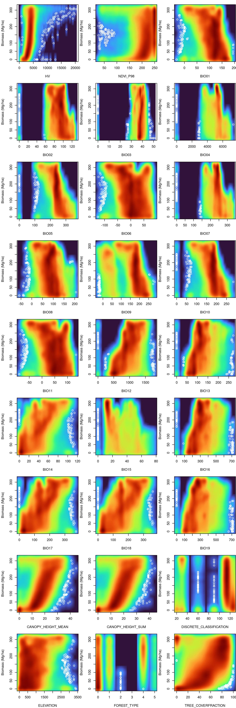
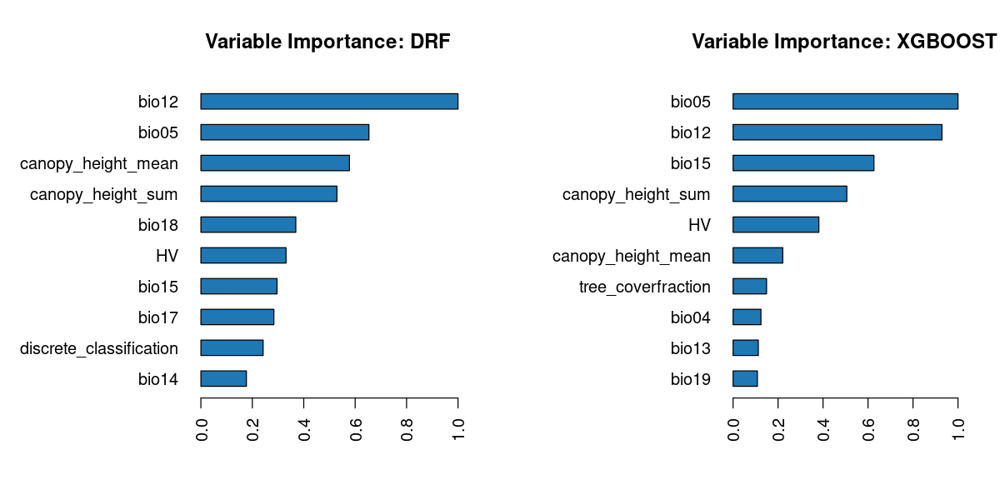
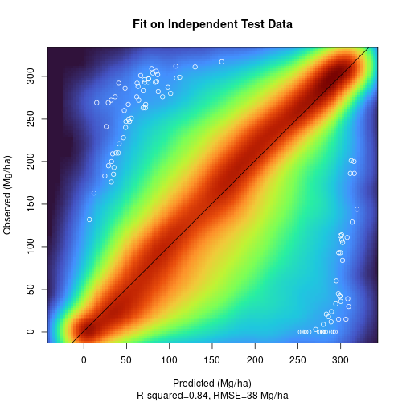
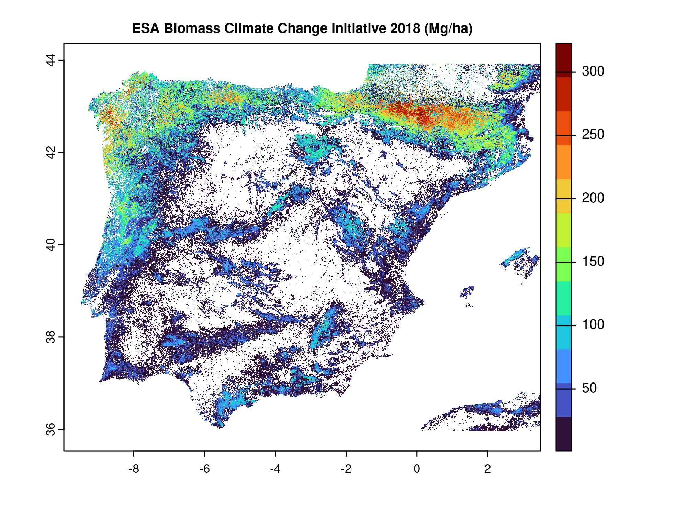
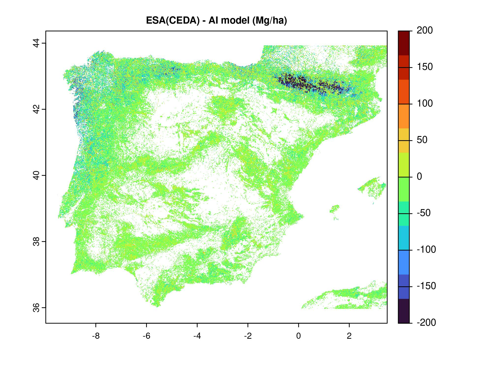
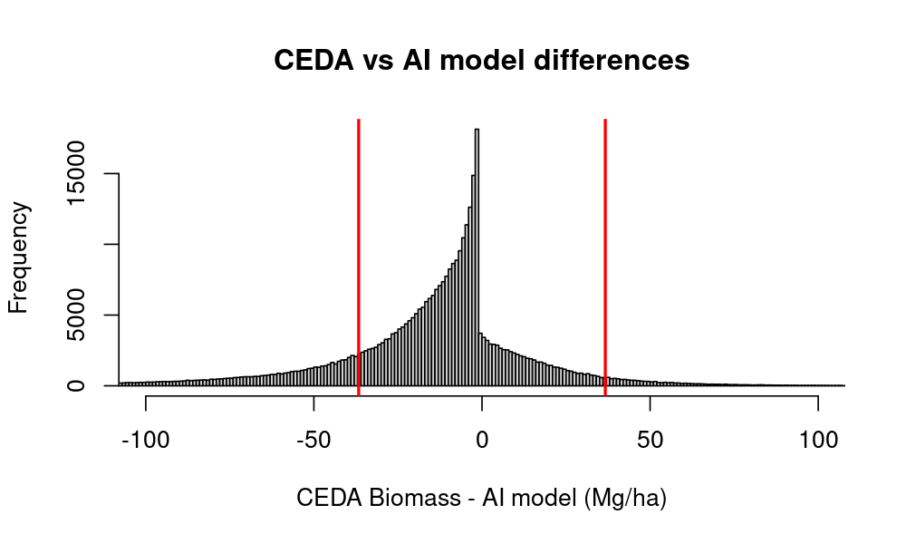

 
```{r setup, include=FALSE}
knitr::opts_chunk$set(echo = TRUE)
```
 
<style>
.zoomDiv {
  opacity: 0;
  position:absolute;
  top: 50%;
  left: 50%;
  z-index: 50;
  transform: translate(-50%, -50%);
  box-shadow: 0px 0px 50px #888888;
  max-height:100%; 
  overflow: scroll;
}

.zoomImg {
  width: 100%;
}
</style>

<script type="text/javascript">
  var tmpwidth=0;
  $(document).ready(function() {
         $(function() {
             $("img").click(function(e) {  
             if( tmpwidth != 0 ){   
                $(this).width(tmpwidth);
                tmpwidth = 0; 
             } else{
                tmpwidth = $(this).width();
                $(this).width($(this).width()*2);
             }
             });
         });   
  });
</script>

xxxx description (Erico?)

## Data

The following data sources are used:

###  Dependent variable: 

 - [Above Ground Biomass](https://data.ceda.ac.uk/neodc/esacci/biomass/data/agb/maps/v3.0). 
 We used as proxy the biomass from ESA Biomass Climate Change Initiative (Biomass_cci): Global datasets of forest above-ground biomass for the years  v3
    - Year: 2018
    - Resolution: ≈100 m (actually in degrees so depends on latitude)
    - Layers: 
      - **Above ground biomass**
      - **Above ground biomass standard error**

###  Independent variables: 

Also referred to as "features" or "descriptors", these are variables that are 
likely to be correlated, and thus help to predict,  the biomass in a specific
location. 

In general obvious variables such as forest canopy cover fraction and 
tree height values are used, but also more indirect variables such as climatic
variables, height above sea level, forest types etc... are used in the 
machine learning predictive algorithm. 


 - [COPERNICUS_Landcover_100m_Proba-V-C3_Global](https://developers.google.com/earth-engine/datasets/catalog/COPERNICUS_Landcover_100m_Proba-V-C3_Global){target=_blank}
    - Year: 2019
    - Resolution:100 m
    - Layers: 
      - **land cover category**
      - **forest type**
      - **forest canopy cover %**
  
 - [Canopy height from ETH](https://nlang.users.earthengine.app/view/global-canopy-height-2020?fbclid=IwAR1gc3R5uGr04PswUVzWekvykmcdJRRpL7kzYXcAxzdYZl1U5_1wJvPl2YM){target=_blank}
    - Year: 2020
    - Resolution: 10 m
    - Layers were aggregated to 100 m: 
      - Average - **canopy height_mean**
      - Sum - **canopy height_sum**
    Lang, N., Jetz, W., Schindler, K., & Wegner, J. D. (2022). A high-resolution canopy height model of the Earth. arXiv preprint arXiv:2204.08322
     
 - [Annual NDVI Composite](https://developers.google.com/earth-engine/datasets/catalog/VITO_PROBAV_C1_S1_TOC_100M)
 The 100 m resolution
 [More info](https://proba-v.vgt.vito.be/sites/proba-v.vgt.vito.be/files/products_user_manual.pdf)
 NDVI is well-known to be related to biomass values, even if the prediction
 efficiency decreases at high biomass values. 
    - Year: 2020
    - Every 5 days
    - Resolution: 100 m 
      - Temporal composite - **ndvi**

 - [ALOS PALSAR2](https://developers.google.com/earth-engine/datasets/catalog/JAXA_ALOS_PALSAR_YEARLY_SAR)
 SAR backscatter is related to the amount of vegetation available in the area. 
    - Year: 2020
    - Resolution: 25 m
    - Layers were aggregated to 100 m: 
      - Average HV polarization - **HV**


 - [SRTM Elevation Grid](https://developers.google.com/earth-engine/datasets/catalog/CGIAR_SRTM90_V4?hl=en){target=_blank}
    - Year: 2000
    - Resolution: 90 m
    - Layers: 
		- **elevation** 
		
 - [Bioclimatic variables from WorldClim (Berkeley University)](developers.google.com/earth-engine/datasets/catalog/WORLDCLIM_V1_BIO){target=_blank}
    - Year: 1960-1991
    - Resolution: 1000 m
    - Layers: 
		- **bio01**	Annual mean temperature	-290	320	°C	0.1
		- **bio02**	Mean diurnal range (mean of monthly (max temp - min temp))	9	214	°C	0.1
		- **bio03**	Isothermality (bio02/bio07)	7	96	%	0
		- **bio04**	Temperature seasonality (Standard deviation * 100)	62	22721	°C	0.01
		- **bio05**	Max temperature of warmest month	-96	490	°C	0.1
		- **bio06**	Min temperature of coldest month	-573	258	°C	0.1
		- **bio07**	Temperature annual range (bio05-bio06)	53	725	°C	0.1
		- **bio08**	Mean temperature of wettest quarter	-285	378	°C	0.1
		- **bio09**	Mean temperature of driest quarter	-521	366	°C	0.1
		- **bio10**	Mean temperature of warmest quarter	-143	383	°C	0.1
		- **bio11**	Mean temperature of coldest quarter	-521	289	°C	0.1
		- **bio12**	Annual precipitation	0	11401	mm	0
		- **bio13**	Precipitation of wettest month	0	2949	mm	0
		- **bio14**	Precipitation of driest month	0	752	mm	0
		- **bio15**	Precipitation seasonality	0	265	Coefficient of Variation	0
		- **bio16**	Precipitation of wettest quarter	0	8019	mm	0
		- **bio17**	Precipitation of driest quarter	0	2495	mm	0
		- **bio18**	Precipitation of warmest quarter	0	6090	mm	0
		- **bio19**	Precipitation of coldest quarter	0	5162	mm	0

 
## Data pre-processing


Data collection and preparation was carried out in **Google Earth Engine**.


[Link to GEE code](https://code.earthengine.google.com/?scriptPath=users%2Fcirgeo%2Fpirotti%3AFIRE-RES%2Ffire-res-biomass_ML){target=_blank}


### Masking non-burnable areas

First we mask the LULC map removing non-burnable areas as per Scott and Burgan NB(1,2,3) etc...

```{javascript}
var lulc_mask = LULC.neq(0)
                    .multiply(LULC.neq(40)) // agriculture (NB3)
                    .multiply(LULC.neq(50))  // urban (NB1)
                    .multiply(LULC.neq(70))  // snow and ice (NB2)
                    .multiply(LULC.neq(80))  // Permanent water lakes (NB8)
                    .multiply(LULC.neq(100)) // MOSS AND LICKEN (NB9??)
                    .multiply(LULC.neq(200)) // OCEAN  (NB8)
``` 
 
All data were reprojected to geographic WGS84 (EPSG:4326) coordinates 
with ≈100 m 

≈220'000 sample points were taken from the area by stratified sampling
using, as strata, the 13 LULC classes and biomass classes at 10 Mg/ha
intervals, for a total of 48 biomass classes. This allowed for a balanced
representation of different land use (shrub to thick forest) and of
estimated biomass at pixel level. 

## Training AI

Biomass ground truth data are not easily reached due to the very different 
sampling protocols and many countries not providing the information 
as open data. 

Some dedicated EU projects, such as GLOBIOMASS, were funded with the main
goal to create biomass maps. We therefore decided to use these maps
for training an ensemble of machine learning methods using as descriptors the 
data-rich environment from the above-listed data, **for a total of 27 variables
as features**. 

The plot below shows the relation between the variables and the 
biomass.

  


 
The rationale behind this decision is that the dependent variable, i.e. the
AGB, is mapped with a well-documented uncertainty via the 2018 CEDA biomass map. 
By collecting a large number of samples from the area with stratified sampling
that accounts for land-cover type and biomass class, we will augment available
training data from ground samples. 

The continous biomass variable values were grouped in 10 classes each of size 50
Mg/ha to provide a stratified sampling that represent evenly different biomass
profiles. A total of **260'000 samples** are used for training. 

5-fold cross-validation on training data (Metrics computed for combined holdout predictions) provided the following performance metrics 
for biomass (Mg/ha):

MSE:  | 1372
RMSE: | 37.1
MAE:  | 24.7

### Variable importance

The plots below are variable importance from the random forest and the gradient boosting methods of the ensamble pf machine learning methods.


  


## Testing AI

Testing on an independent set of 140'000 points, sampled just like the training
points (stratified the same way), provided the following performance metrics 
for biomass (Mg/ha):

MSE:  | 1421
RMSE: | 38.7
MAE:  | 25.6


  
<label > </label>


## RESULTS

<a href="output/biomassFromML.tif"  >DOWNLOAD Biomass MAP from AI Model</a>


<a href="output/biomassFromCEDA.tif"  >DOWNLOAD Biomass MAP from ESA Climate (CEDA)</a>


  
 
  
 
  

 


## Problems and solutions

### Data size

Maximum size of data tables in R is about 2 billion elements. 
A 100 m resolution raster of Western Europe (Spain + Portugal) as in figure below, has 
about 48 million cells with biomass above 0 Mg/ha. 
R has a limit of vector size, therefore to avoid this and to 
make full use of parallel processing, we divided in chunks of 
10 million cells for the prediction step. 
 

